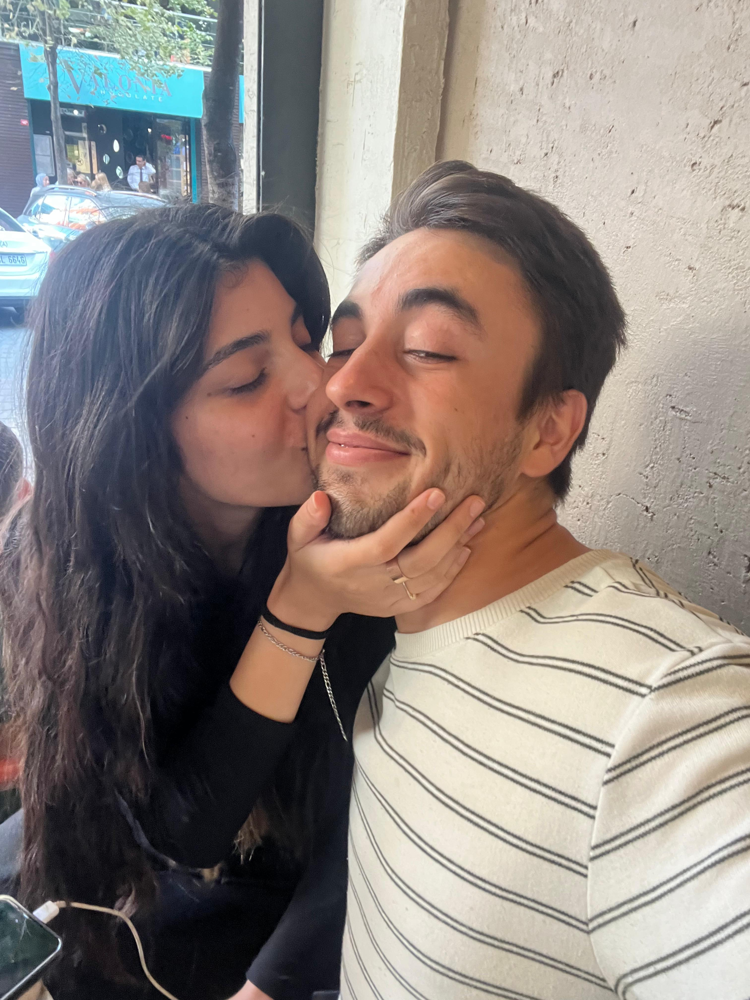
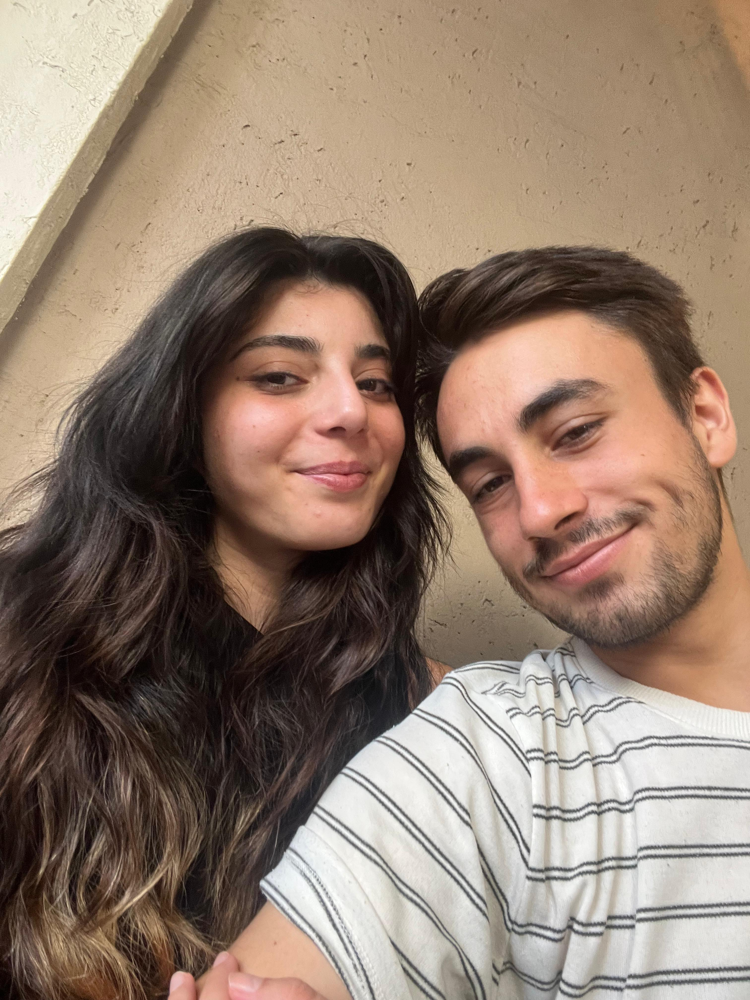
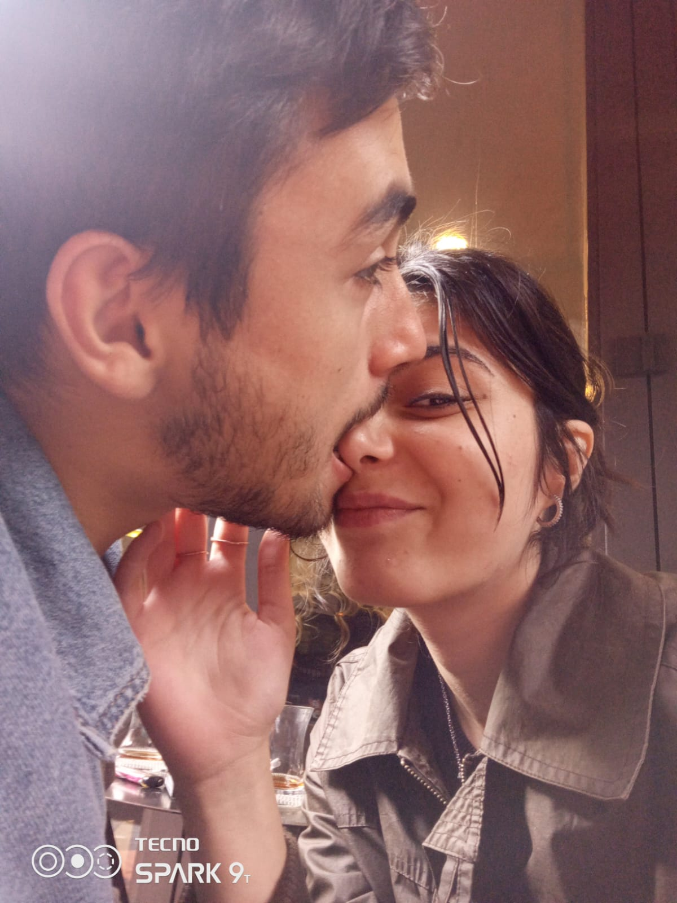
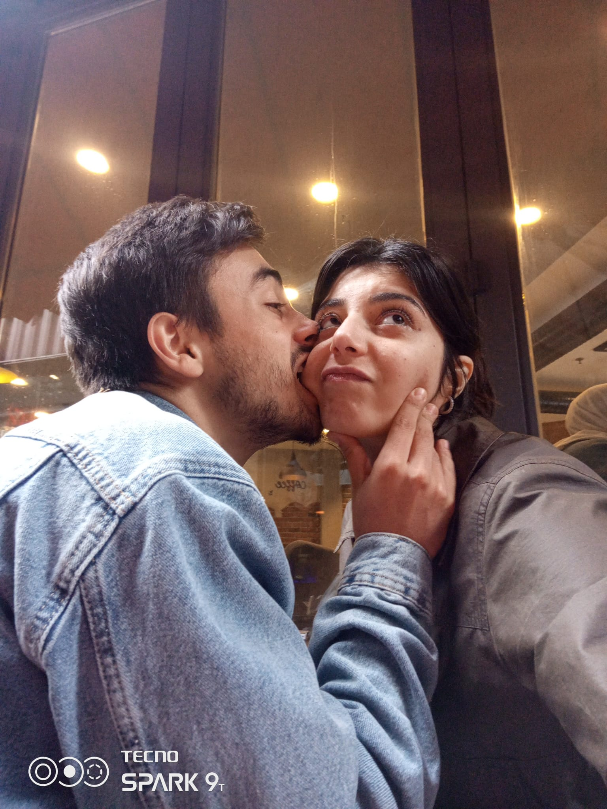

<!DOCTYPE html>
<html lang="tr">
<head>
    <meta charset="UTF-8">
    <title>9. Ayımız 💖</title>
    
</head>
<body>

    <!-- Süslemeler -->
    

        
❤️

        
💖

        
💗

        
🌼

        
🌼

        
🌼

    

    <header>
        <h1>30 Eylül – 9. Ayımız 💘</h1>
    </header>

    

        

            

                30 Eylül... Belki birçoğu için sıradan bir gün ama bizim için anlamı bambaşka. Tam 9 aydır hayatımı güzelleştiren, kalbimi ısıtan, ruhuma dokunan seninle yanyana yürüyoruz bu yolu.
            

            

                Bu süreçte birlikte güldük, birlikte sustuk, birlikte ağladık. İkimiz de en değerli parçalarımızdan birini yitirdik; kuzenlerimizi... Teyze oğullarımızın beklenmedik vedası içimizde kapanmayan bir yara bıraktı. Ama işte tam da o anlarda, gözlerim senin gözlerini aradı. Ve bulduğumda, "yalnız değilim" dedim.
            

            

                Seninle her şey daha anlamlı. Zorluklar geldiğinde kaçmak değil, birbirimize sarılmak en güzel çözümümüz oldu.
            

            

                9 ay belki takvimde küçük bir sayı. Ama bizim yaşadıklarımızı, hissettiklerimizi koyabileceğimiz koca bir ömürden parçalar taşıyor içinde.
            

            

                Seni seviyorum. Çünkü sadece iyi günlerde değil, en karanlık zamanlarda bile elimden tutan sen oldun. Ve bil ki, ben de her zaman senin elini tutmaya hazırım…
            

        

        <!-- Fotoğraflar -->

        

            
            
"Bu an, gözlerinde ilk defa kendimi gördüğüm andı. Zaman durdu, sadece sen vardın."

        

        

            
            
"Sen güldüğünde dünya daha güzel bir yer oluyor. Bunu her defasında kanıtlıyorsun."

        

        

            
            
"Sessizliğimiz bile anlamlı. Yanındayken konuşmaya gerek yok; kalbin kalbime anlatıyor her şeyi."

        

        

            
            
"İşte burası huzur… Yanın. Tenin. Nefesin. Sen."

        

        <!-- Son Yazı -->

        

            

                Hayat ne getirirse getirsin, senin yanında olacağıma söz verdim. Sadece bu 9 ayda değil, önümüzdeki yıllarda da; iyi günde kötü günde, ağladığında omuz, güldüğünde kahkaha, sustuğunda anlayış olacağım.
            

            

                Bu hayat yolculuğunda, yönünü kaybettiğinde puslan, yorulduğunda dinlenme yerin, karanlıkta el fenerin olmak istiyorum.
            

            

                Çünkü ben seni, sadece sevmekle kalmadım; sana hayran oldum, sana bağlandım, seni seçtim. Ve her sabah yeniden seni seçmeye devam edeceğim.
            

        

    

    <footer>
        &copy; 2024.12.30 | YASİN 💌 ALEYNA
    </footer>

</body>
</html>
